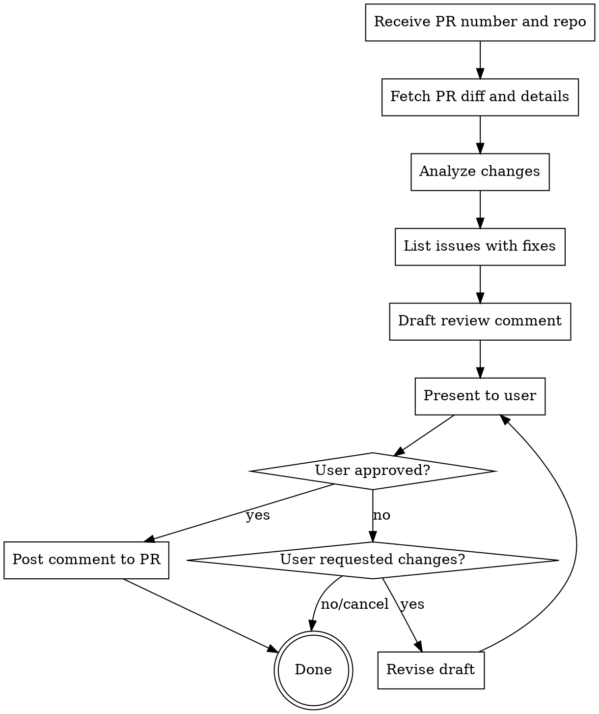

# Interactive PR Review

Review a PR, identify issues with fixes, draft a comment for approval, then post only when explicitly approved.

## Workflow



## Required Information

Before starting, confirm you have:

- Repository in `owner/repo` format
- PR number

If not provided, ask the user.

## Analysis Output Format

Present findings in this structure:

```markdown
## PR Summary

[1-2 sentence description of what the PR does]

## Issues Found

### 1. [Issue Title]

**Location:** `file.ts:123`
**Severity:** High/Medium/Low
**Issue:** [What's wrong]
**Suggested Fix:** [How to fix it]

### 2. [Next issue...]

## Draft Review Comment

---

## [The actual comment text that would be posted]

**Review type:** Comment / Approve / Request Changes

Ready to post? Say "post it" or request modifications.
```

## Approval Triggers

Only post after explicit approval:

- "post it"
- "submit"
- "looks good, post"
- "approve and post"

## Revision Triggers

Revise the draft when user says:

- "soften the tone"
- "be more specific about..."
- "remove point X"
- "add a note about..."
- "change to request changes"

## Do NOT Post When

- User says "cancel", "nevermind", "stop"
- User hasn't explicitly approved
- User is still asking questions about the PR
- No explicit approval phrase was given

## Review Types

| Type            | When to Use                              |
| --------------- | ---------------------------------------- |
| Comment         | General feedback, questions, suggestions |
| Approve         | Code looks good, minor or no issues      |
| Request Changes | Blocking issues that must be fixed       |

Default to "Comment" unless user specifies otherwise.
